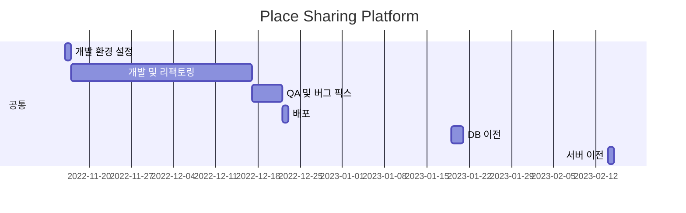

# [Place Sharing Platform](https://place-sharing-platform.vercel.app)

## 0. Update log

- 2023.02.13 ~ 2023.02.28 : User 및 Reservation Entity 리팩토링 진행 중 (From 'Transaction Script Pattern' to 'Domain Model Pattern') (담당자 : 이동훈)
- 2023.02.14 ~ 2023.02.14 : PSP 메인 플랫폼 서버 이전 (from CloudType to Oracle Cloud)(PEEK TPS 4000% 증가) (담당자 : 이동훈)
- 2023.01.19 ~ 2023.01.20 : DB 서버 이전 (from Local PC to Oracle Cloud) (담당자 : 이동훈)
- 2022.12.22 ~ 2022.12.23 : 배포
- 2022.12.17 ~ 2022.12.22 : QA 및 버그 픽스
- 2022.11.17 ~ 2022.12.17 : 개발 및 리팩토링
- 2022.11.16 ~ 2022.11.16 : 개발 환경 설정

## 1. 팀 구성

- - -

| 구분  | 성명                                     | 담당  |
|-----|----------------------------------------|-----|
| 팀장  | [오령기](https://github.com/ryeongee)     | BE  |
| 팀원  | [최한성](https://github.com/hansung0904)  | BE  |
| 팀원  | [이동훈](https://github.com/darkblose)    | BE  |
| 팀원  | [이찬형](https://github.com/LEECHANHYUNG) | FE  |

## 2. 프로젝트 소개

- - -

#### 주제 : 사무공간 대여 서비스

#### 개발 기간 : 2022-11-16 ~ 2022-12-22

#### 서비스 구조

| 서버 구분                           	     | 서버 역할             	 | 비고                                                                                                                                                         	                                                                                                                              |
|---------------------------------------|---------------------|-------------------------------------------------------------------------------------------------------------------------------------------------------------------------------------------------------------------------------------------------------------------------------------------|
| Next.js App                         	 | 메인 플랫폼 VIEW 서버 	    | [서비스](https://place-sharing-platform.vercel.app), [깃허브](https://github.com/Hell-O-Demon-World/OfficeSharingPlatformFETest) 	                                                                                                                                                              |
| Spring Boot Application             	 | 메인 플랫폼 API 서버  	    | [깃허브](https://github.com/Hell-O-Demon-World/PlaceSharingPlatformBETest)                                                                                                                                                   	                                                               |
| Spring Boot Application + Thymeleaf 	 | 백오피스 WAS          	 | [서비스](https://port-0-psp-back-office-883524lbtbkgal.gksl2.cloudtype.app), [깃허브](https://github.com/Hell-O-Demon-World/BackOfficeTest)                                                                                                                                                   	 |
| Spring Boot Application + Thymeleaf 	 | 관리자 페이지 WAS     	   | [서비스](https://port-0-psp-admin-page-883524lbtbkgal.gksl2.cloudtype.app), [깃허브](https://github.com/Hell-O-Demon-World/AdminPageTest)                                                                                                                                                   	   |

### 3. 개발 내용

- - -

#### 메인 플랫폼

#### 백오피스

#### 관리자 페이지

### 4. 개발 환경

- - -

#### 사용 기술 - BE

#### 사용 기술 - FE

#### 개발 환경

#### E-R 다이어그램

### 5. 개발 일정 및 담당

- - -

#### 개발 일정

#### 개발 담당

