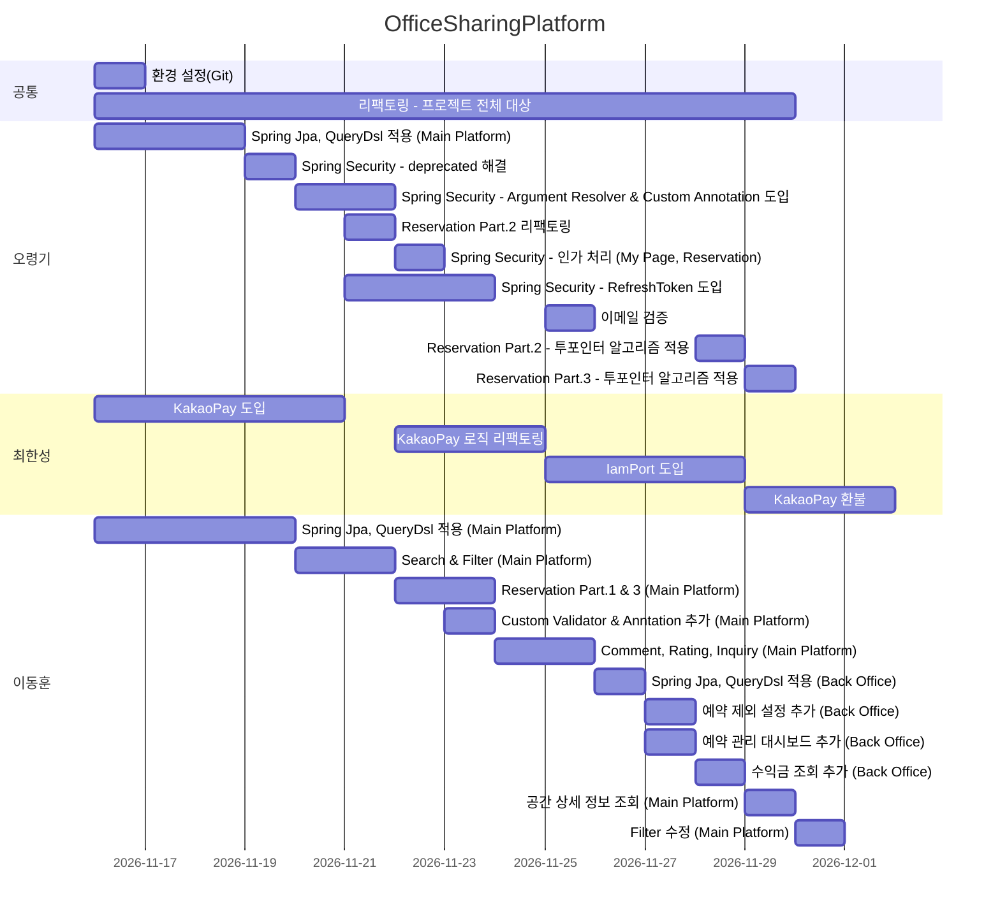

# OfficeSharingPlatform

## Repository for Developing Project

### BE : 오령기, 최한성, 이동훈

### FE : 이찬형

### 개발 일정

```mermaid
gantt
dateFormat MM-DD
title OfficeSharingPlatform

    section 공통
    환경 설정(Git)             :chap1, 11-16, 1d
    리팩토링 - 프로젝트 전체 대상   :chap2, 11-16, 11-30

    section 오령기
    Spring Jpa, QueryDsl 적용 (Main Platform)                     : chap1, 11-16, 3d
    Spring Security - deprecated 해결                             : chap2, 11-19, 1d
    Spring Security - Argument Resolver & Custom Annotation 도입  : chap3, 11-20, 2d
    Reservation Part.2 리팩토링                                    : chap4, 11-21, 1d
    Spring Security -  인가 처리 (My Page, Reservation)            : chap5, 11-22, 1d
    Spring Security - RefreshToken 도입                           : chap6, 11-21, 3d
    이메일 검증                                                     : chap7, 11-25, 1d
    Reservation Part.2 - 투포인터 알고리즘 적용                        : chap8, 11-28, 1d
    Reservation Part.3 - 투포인터 알고리즘 적용                        : chap8, 11-29, 1d

    section 최한성
    KakaoPay 도입        : chap1, 11-16, 5d
    KakaoPay 로직 리팩토링 : chap2, 11-22, 3d
    IamPort 도입         : chap3, 11-25, 4d
    KakaoPay 환불        : chap4, 11-29, 3d
    
    section 이동훈
    Spring Jpa, QueryDsl 적용 (Main Platform)         : chap1, 11-16, 4d
    Search & Filter (Main Platform)                  : chap2, 11-20, 2d
    Reservation Part.1 & 3 (Main Platform)           : chap3, 11-22, 2d
    Custom Validator & Anntation 추가 (Main Platform) : chap4, 11-23, 1d
    Comment, Rating, Inquiry (Main Platform)         : chap5, 11-24, 2d
    Spring Jpa, QueryDsl 적용 (Back Office)           : chap6, 11-26, 1d
    예약 제외 설정 추가 (Back Office)                     : chap7, 11-27, 1d
    예약 관리 대시보드 추가 (Back Office)                  : chap8, 11-27, 1d
    수익금 조회 추가 (Back Office)                       : chap9, 11-28, 1d
    공간 상세 정보 조회 (Main Platform)                   : chap10, 11-29, 1d
    Filter 수정 (Main Platform)                       : chap11, 11-30, 1d


```